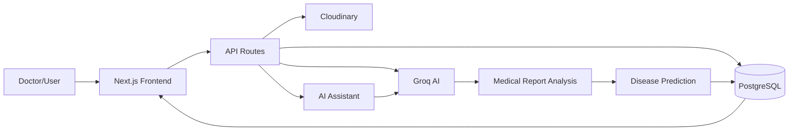
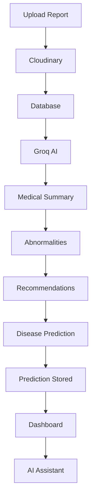
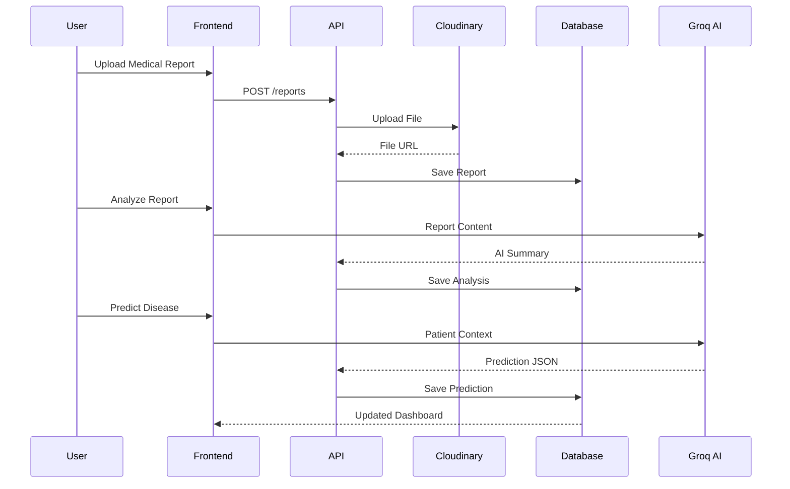
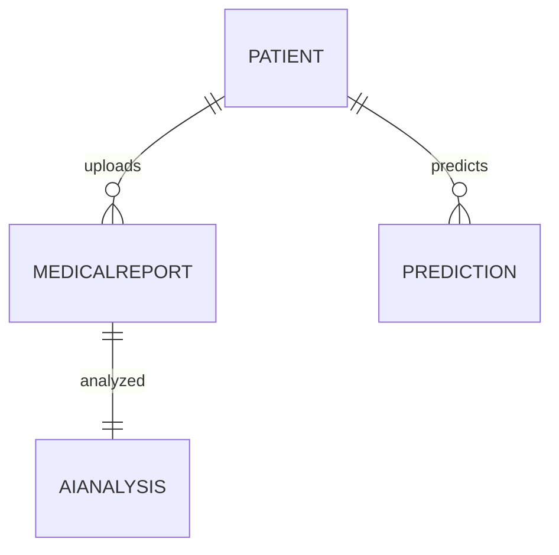

<div align="center">

# 🏥 MedIntel AI

### AI-Powered Healthcare Management Platform

An intelligent healthcare platform that combines **Artificial Intelligence**, **Medical Report Analysis**, **Disease Prediction**, and **Patient Management** into one modern full-stack web application.

Designed to simplify clinical workflows by helping healthcare professionals upload reports, generate AI-powered insights, predict possible diseases, and interact with a patient-aware AI assistant.

---
<div align="center">

# 🚀 Live Demo

### 🌐 **MedIntel AI is Live**

👉 **https://medintel-4cc7g56hu-rutvilandges-projects.vercel.app/**

</div>

---


# 📑 Table of Contents

- Project Overview
- Motivation
- Key Features
- Technology Stack
- System Architecture
- AI Workflow
- Application Flow
- Folder Structure
- Database Design
- API Documentation
- Installation
- Environment Variables
- Running Locally
- Deployment
- Future Enhancements
- Challenges Solved
- Learning Outcomes
- Author

---

# 🌟 Project Overview

MedIntel AI is a modern AI-powered healthcare platform that assists doctors and healthcare professionals in managing patient information, uploading medical reports, performing AI-powered medical analysis, predicting disease risks, and interacting with an intelligent AI medical assistant.

Unlike traditional hospital management systems, MedIntel AI integrates **Generative AI** directly into the workflow to improve report understanding and provide intelligent clinical assistance.

The application demonstrates how modern AI technologies can be integrated into full-stack web applications while maintaining a clean architecture and scalable backend.

---

# 🎯 Motivation

Healthcare professionals often spend significant time reviewing reports and identifying abnormalities manually.

MedIntel AI was developed to demonstrate how Large Language Models (LLMs) can enhance healthcare software by:

- Reducing report review time
- Summarizing complex medical reports
- Identifying abnormalities
- Suggesting recommendations
- Predicting possible diseases
- Assisting doctors through conversational AI

The goal is not to replace medical professionals, but to provide intelligent decision support.

---

# ✨ Key Features

## 🔐 Authentication

- Secure user authentication
- Protected dashboard routes
- Session management
- NextAuth integration

---

## 👨‍⚕️ Patient Management

- Register new patients
- Update patient details
- Delete patient records
- View patient profiles
- Recent patients dashboard
- Complete medical history

---

## 📄 Medical Report Management

- Upload reports
- Cloudinary file storage
- Download reports
- Delete reports
- Organize reports by patient

Supported report types include:

- Blood Test
- MRI
- CT Scan
- X-Ray
- ECG
- Prescription
- Ultrasound
- Other Medical Documents

---

## 🧠 AI Report Analysis

Every uploaded medical report can be analyzed using Groq AI.

Generated insights include:

- Medical Summary
- Key Findings
- Abnormalities
- Clinical Recommendations

---

## 🩺 AI Disease Prediction

Using patient information together with AI-analyzed reports, MedIntel AI predicts possible diseases and provides:

- Predicted Disease
- Probability Score
- Risk Classification
- AI Reasoning
- Medical Recommendations

---

## 🤖 AI Medical Assistant

An intelligent assistant capable of answering patient-specific questions such as:

- Summarize patient history
- Explain abnormalities
- Explain reports in simple language
- Predict disease risks
- Suggest follow-up tests
- Lifestyle recommendations
- Clinical observations

---

## 📊 Dashboard

Real-time analytics dashboard containing:

- Total Patients
- Medical Reports
- AI Analyses
- Disease Predictions
- Recent Reports
- Recent Patients
- AI Assistant

---

## 🎨 User Experience

- Responsive UI
- Modern Dashboard
- Glassmorphism Design
- Gradient Backgrounds
- Interactive Cards
- Dark Theme
- Smooth User Experience

---

# 🛠 Technology Stack

| Category | Technology |
|-----------|------------|
| Frontend | Next.js 15 |
| Language | TypeScript |
| Styling | Tailwind CSS |
| Icons | Lucide React |
| Backend | Next.js API Routes |
| ORM | Prisma |
| Database | PostgreSQL (Neon) |
| Authentication | NextAuth |
| AI Model | Groq (Llama 3.3 70B Versatile) |
| File Storage | Cloudinary |
| Deployment | Vercel |

---

# 🏗 System Architecture



---

# 🧠 AI Workflow



---

# 🔄 Application Request Flow



---

# 📂 Project Structure

```
MedIntel-AI

app/
│
├── api/
├── dashboard/
├── auth/
│
components/
│
├── assistant/
├── dashboard/
├── patients/
├── prediction/
├── reports/
│
lib/
│
prisma/
│
public/
│
types/
│
styles/
```

---
# 📦 Folder Structure Explained

## `app/`

Contains all pages and API routes built using the Next.js App Router.

| Folder | Purpose |
|---------|----------|
| `dashboard/` | Main application dashboard |
| `patients/` | Patient management pages |
| `reports/` | Medical report pages |
| `prediction/` | AI Disease Prediction |
| `assistant/` | AI Medical Assistant |
| `api/` | Backend REST API endpoints |

---

## `components/`

Reusable UI components.

```
components
│
├── assistant/
│     └── AssistantChat.tsx
│
├── dashboard/
│     ├── DashboardCard.tsx
│     ├── QuickActions.tsx
│     ├── RecentReports.tsx
│     └── PatientTable.tsx
│
├── patients/
│
├── prediction/
│
└── reports/
```

---

## `lib/`

Contains reusable backend utilities.

```
lib
│
├── prisma.ts
├── cloudinary.ts
├── groq.ts
├── auth.ts
└── utils.ts
```

---

## `prisma/`

Contains the complete database schema.

```
prisma

schema.prisma
```

---

# 🗄 Database Design

The application follows a relational database design using PostgreSQL and Prisma ORM.

---

## User

Stores authenticated users.

```
User

id
name
email
password
createdAt
updatedAt
```

---

## Patient

Stores patient information.

```
Patient

id
fullName
age
gender
phone
email
bloodGroup
address
createdAt
updatedAt
```

---

## MedicalReport

Stores uploaded medical reports.

```
MedicalReport

id
patientId
title
reportType
hospital
doctorName
fileUrl
cloudinaryId
status
uploadedAt
```

---

## AIAnalysis

Stores AI-generated report analysis.

```
AIAnalysis

id
reportId
summary
abnormalities
recommendation
createdAt
```

---

## Prediction

Stores AI disease prediction results.

```
Prediction

id
patientId
disease
probability
risk
reasoning
recommendations
createdAt
```

---

# 🧩 Database Relationships



---

# 🌐 API Documentation

---

## Authentication

| Method | Endpoint |
|---------|----------|
| POST | `/api/auth/signin` |
| POST | `/api/auth/signout` |

---

## Patients

| Method | Endpoint | Description |
|---------|----------|-------------|
| GET | `/api/patients` | Get all patients |
| POST | `/api/patients` | Create patient |
| GET | `/api/patients/:id` | Patient details |
| PUT | `/api/patients/:id` | Update patient |
| DELETE | `/api/patients/:id` | Delete patient |

---

## Reports

| Method | Endpoint | Description |
|---------|----------|-------------|
| GET | `/api/reports` | Get reports |
| POST | `/api/reports` | Upload report |
| DELETE | `/api/reports/:id` | Delete report |

---

## AI Analysis

| Method | Endpoint |
|---------|----------|
| POST | `/api/ai/analyze` |

---

## AI Disease Prediction

| Method | Endpoint |
|---------|----------|
| POST | `/api/prediction` |

---

## AI Assistant

| Method | Endpoint |
|---------|----------|
| POST | `/api/assistant` |

---

# ⚙️ Installation

Clone the repository

```bash
git clone https://github.com/YOUR_USERNAME/medintel-ai.git
```

Move into the project

```bash
cd medintel-ai
```

Install dependencies

```bash
npm install
```

---

# 🔑 Environment Variables

Create a `.env` file in the root directory.

```env
DATABASE_URL=

NEXTAUTH_SECRET=

NEXTAUTH_URL=http://localhost:3000

GROQ_API_KEY=

CLOUDINARY_CLOUD_NAME=

CLOUDINARY_API_KEY=

CLOUDINARY_API_SECRET=
```

---

# 🗃 Prisma Setup

Generate Prisma Client

```bash
npx prisma generate
```

Push schema

```bash
npx prisma db push
```

(Optional)

```bash
npx prisma studio
```

---

# ▶️ Running the Application

Development

```bash
npm run dev
```

Production

```bash
npm run build
```

```bash
npm start
```

---

# 🚀 Deployment

The project is designed to be deployed using

- **Vercel**
- **Neon PostgreSQL**
- **Cloudinary**
- **Groq AI**

Deployment Steps

1. Push project to GitHub
2. Import repository into Vercel
3. Configure environment variables
4. Deploy
5. Connect Neon Database
6. Configure Cloudinary
7. Configure Groq API Key

Your application is now production ready.

---
# 🔒 Security Features

MedIntel AI follows several best practices to ensure security and maintainability.

### Authentication

- Secure authentication using NextAuth
- Protected dashboard routes
- Session-based authentication
- Unauthorized access prevention

### Database

- Prisma ORM prevents SQL Injection
- Type-safe database queries
- Relational database design
- Cascade deletion where appropriate

### File Storage

- Cloudinary secure cloud storage
- Secure file URLs
- Centralized media management

### API

- RESTful API architecture
- Server-side validation
- Error handling
- JSON responses

---

# 🧠 AI Integration

The application integrates **Groq AI (Llama 3.3 70B Versatile)** to provide intelligent healthcare assistance.

## AI Features

### Medical Report Analysis

The uploaded report is analyzed to generate:

- Medical Summary
- Important Findings
- Abnormalities
- Recommendations

---

### Disease Prediction

Using

- Patient Information
- Report Details
- AI Analysis

the system predicts

- Possible Disease
- Probability
- Risk Level
- AI Reasoning
- Recommendations

---

### AI Medical Assistant

The assistant can answer questions such as

- Summarize patient reports
- Explain abnormalities
- Explain medical terms
- Suggest lifestyle changes
- Explain disease predictions
- Recommend follow-up tests

---

# 📈 Scalability

The project follows a modular architecture allowing future expansion.

Possible future modules include

- Doctor Portal
- Appointment Booking
- Patient Portal
- OCR Report Extraction
- Email Notifications
- PDF Export
- Analytics Dashboard
- Multi Hospital Support
- Role Based Access Control
- AI Confidence Score
- Voice Assistant
- Medical Image Classification
- Electronic Health Records (EHR)

---

# 🚧 Challenges Solved

During development several engineering challenges were addressed.

### Authentication

- Protected Routes
- Session Management
- NextAuth Configuration

---

### Database

- Designing relational models
- One-to-One relationships
- One-to-Many relationships
- Cascade deletion
- Prisma schema optimization

---

### AI Integration

- Prompt Engineering
- JSON structured responses
- Error handling
- Reliable AI parsing
- Medical context generation

---

### Cloud Storage

- Secure uploads
- File management
- Cloudinary integration

---

### Frontend

- Responsive dashboard
- Modern UI
- Glassmorphism
- Component reusability
- Dark theme

---

# 📚 Learning Outcomes

Building MedIntel AI helped strengthen knowledge in

- Full Stack Development
- Next.js App Router
- TypeScript
- Prisma ORM
- PostgreSQL
- REST API Development
- Authentication
- Cloudinary
- AI Integration
- Prompt Engineering
- Database Design
- Software Architecture
- Responsive UI Development
- State Management
- Error Handling
- Deployment

---

# 🎯 Future Enhancements

- AI-powered medical image analysis
- OCR for scanned reports
- Real-time notifications
- AI Confidence Meter
- PDF report export
- Email generated reports
- Analytics dashboard
- Patient Timeline
- Medication Reminder
- Doctor Notes
- Appointment Scheduling
- Voice-based AI Assistant
- Hospital-wise Analytics
- Audit Logs

---

# 💼 Why MedIntel AI?

Healthcare applications require much more than simple CRUD operations.

MedIntel AI demonstrates the integration of Artificial Intelligence with modern full-stack development to solve real-world healthcare problems.

The project combines secure authentication, cloud storage, relational databases, AI-powered report understanding, disease prediction, conversational AI, and a scalable architecture into a single production-style application.

This project reflects practical software engineering principles while showcasing the potential of Large Language Models in healthcare.

---

# 🤝 Contributing

Contributions, feature suggestions, and improvements are always welcome.

If you'd like to contribute:

1. Fork the repository
2. Create a new feature branch
3. Commit your changes
4. Push your branch
5. Open a Pull Request

---

# 📄 License

This project is licensed under the **MIT License**.

Feel free to use this project for learning and educational purposes.

---

# 👩‍💻 Author

## Rutvi Landge


### 📧 Email

**rutvilandge@gmail.com**


### 🔗 LinkedIn

**https://www.linkedin.com/in/rutvi-landge-9988413b0**

---

#

<div align="center">

# ⭐ If you found this project useful, consider giving it a star!

### Built with ❤️ by Rutvi Landge

**MedIntel AI — Bringing Artificial Intelligence to Modern Healthcare**

</div>
